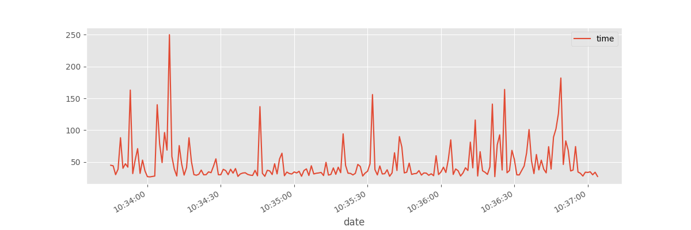

## Time Series Ping

Série Temporal feita com o tempo de resposta com comando `ping`.


Os dados são obtidos com o comando `ping` e escritos em uma arquivo de *log*. Os Parâmetros em negrito devem ser inseridos.

```console
* ping "IP" -c "SIZE" | xargs -n1 -i bash -c 'echo `date +"%Y-%m-%d %H:%M:%S"`" {}"' >> "FILE.log"
```


```console
2018-12-05 12:38:45 PING 8.8.8.8 (8.8.8.8) 56(84) bytes of data.
2018-12-05 12:38:45 64 bytes from 8.8.8.8: icmp_seq=1 ttl=118 time=33.3 ms
2018-12-05 12:38:46 64 bytes from 8.8.8.8: icmp_seq=2 ttl=118 time=28.3 ms
2018-12-05 12:38:47 64 bytes from 8.8.8.8: icmp_seq=3 ttl=118 time=40.2 ms
2018-12-05 12:38:48 64 bytes from 8.8.8.8: icmp_seq=4 ttl=118 time=47.5 ms
```

Em seguida os dados são pre-processados em *dataframe* exportados para arquivo *csv*

```console
                     time
date                     
2018-12-05 10:33:45  44.9
2018-12-05 10:33:46  44.0
2018-12-05 10:33:47  30.1
2018-12-05 10:33:48  38.7
2018-12-05 10:33:49  88.2
```

Em formato dataframe os dados podem ser manipulados como séries temporais e a arte de descrever, modelar, analisar e prever começa.


